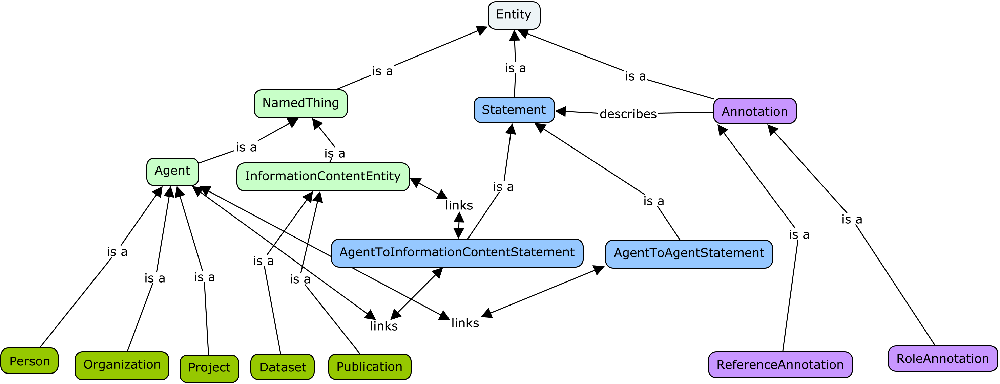
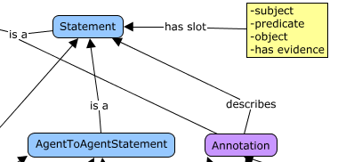

# PPOD_Core - A LinkML Schema

This repository contains a LinkML schema for the core elements of the PPOD (Persons-Projects-Organizations-Datasets) data pattern. It is developed using [LinkML](https://linkml.io/), which is an emerging standard and toolset for describing data schemas with an orientation towards building linked data applications. LinkML data schemas are written in YAML and the framework provides tools to convert these schemas into a number of other formats, including JSON-Schema, OWL, SQL DDL, SHACL, ShEx, and Python classes.  The framework also provides tools for validating and converting data between different formats including RDF, CSV, JSON, YAML, and SQLite databases.  As such LinkML is intended as a lingua franca for interoperability between data schemas and datasets.

LinkML provides a facility to automatically generate a set of web pages describing the elements in the schema, one web page per element. This has been carried out for the PPOD_Core schema and has been [posted on GitHub Pages](https://ppodschema.github.io/PPOD_Core/).



Figure 1 above shows the class structure of the PPOD Core schema. The root element is the Entity class. This is subclassed into three elements, NamedThings, Statements, and Annotations. NamedThings are the concrete elements we are describing in this system, and are divided into two major categories, Agents and Information Content Entities. Agents in turn are subclassed into Persons, Organizations, and Projects, and Information Content Entities are subclassed into Publications and Datasets. Statements are entities that provide assertions about any of the NamedThings. These assertions are expressed as subject-predicate-object triples of information where the subject is a particular NamedThing, the predicate is a linking relationship, and the object may either be another NamedThing or a data value. Annotation elements are used to provide additional context and information about individual Statements. The two types of Annotations described in the core schema are ReferenceAnnotations and RoleAnnotations, with ReferenceAnnotations giving source and provenance information for a statement, and RoleAnnotations giving details on particular AgentToAgentStatements, such the starting and ending dates in a "is member of" statement.

The design of this schema has been inspired by the development of [Biolink](https://ascpt.onlinelibrary.wiley.com/doi/full/10.1111/cts.13302) [^1] and the [data model used for Wikidata](https://www.mediawiki.org/wiki/Wikibase/DataModel/Primer). Both these data models build upon the [RDF model](https://www.w3.org/RDF/) of describing relationships between entities in terms of triples. Biolink and Wikidata share the data pattern of describing high-level concepts in terms of a hierarchical class structure (NamedThings in both Biolink and PPOD Core, Items in Wikidata) and relationships between instances of these concepts expressed as triples (Associations in Biolink, Statements in Wikidata and PPOD Core.) Expressing these triples as individual instances of classes is a pattern called [RDF reification](https://www.w3.org/TR/rdf11-mt/#reification), and this allows for making statements about other statements. Figure 2 illustrates how this pattern is handled inside of PPOD Core: every instance of a Statement contains slots for the subject, the predicate, and the object.



This pattern of reifying the subject, predicate, and object allows each statement to be easily annotated. PPOD Core provides a slot for "has evidence" which is intended to contain information about the source for each statement. These annotation slots allow for the inclusion of many sorts of contextualizing information such as provenance, additional qualifier details for a statement (e.g. dates of service, role titles, etc), uncertainty measures for a statement, or information about the privacy status for a statement.

PPOD Core uses enumeration elements (enums) in LinkML as a mechanism to declare which predicates are allowed to be used with particular NamedThings or Statements. Specifically,
each Statement class has a slot_usage section which gives the ranges for the subject, predicate, and object slots. The range under the predicate slot within this slot_usage always refers to an enumeration element containing the details about the predicate, especially the URIs giving the meaning of each predicate in the universe of 
linked data. The following code snippet illustrates this.

```yaml
classes:
  AgentToAgentStatement:
    is_a: Statement
    class_uri: ppc:AgentToAgentStatement
    abstract: true
    description: A statement describing the relationship between two agents.
    slot_usage:
      subject:
        range: Agent
      object: 
        range: Agent
        
  HasMemberStatement:
    is_a: AgentToAgentStatement
    class_uri: ppc:HasMemberStatement
    description: >-
      A statement asserting that an agent has another entity as its member,
      for instance an organization having a person as its member.
    slot_usage:
      predicate:
        range: HasMemberPredicate

enums:
  HasMemberPredicate:
    permissible_values:
      has_member:
        description: The agent has the given entity as its member
        meaning: org:hasMember
```

In this example, AgentToAgentStatement is an abstract class that has ranges of Agent for both the subject and object slots. HasMemberStatement is a subclass of AgentToAgentStatement which inherits the range information for the subject and object slots. The range for the predicate slot is specified as the enum element HasMemberPredicate. This HasMemberPredicate has as its permissible value the string "has_member", but this is anchored to its linked data meaning of org:hasMember, which is a shorthand for the URI http://www.w3.org/ns/org#hasMember. 

The following table lists the properties that are incorporated into PPOD Core, together with the entities they are used with. In case there is a conflict between information in this table and the PPOD Core LinkML schema itself, the schema takes precedence.

|Name   |CURIE                                       |Uppermost relevant entity     |Description                                                                                                                                                                                                                                                      |
|-------|--------------------------------------------|------------------------------|-----------------------------------------------------------------------------------------------------------------------------------------------------------------------------------------------------------------------------------------------------------------|
|name   |dcterms:title                               |Entity                        |name of the entity                                                                                                                                                                                                                                               |
|id     |schema:identifier                           |Entity                        |Canonical identifier for the entity                                                                                                                                                                                                                              |
|description|dcterms:description                         |Entity                        |an account of the resource                                                                                                                                                                                                                                       |
|label  |rdfs:label                                  |Entity                        |a captioning label for the entity                                                                                                                                                                                                                                |
|alias  |skos:altLabel                               |NamedThing                    |Alternative name for the entity                                                                                                                                                                                                                                  |
|has_part|dcterms:hasPart                             |NamedThing                    |A related resource that is included either physically or logically in the described resource.                                                                                                                                                                    |
|is_part_of|dcterms:isPartOf                            |NamedThing                    |entity is part of the related entity                                                                                                                                                                                                                             |
|has_member|org:hasMember                               |Agent                         |Indicates an agent (person or other organization) who is a member of the subject Organization.                                                                                                                                                                   |
|is_member_of|org:memberOf                                |Agent                         |is a member of the related entity                                                                                                                                                                                                                                |
|address|schema:address                              |Agent                         |physical address of the item                                                                                                                                                                                                                                     |
|phone_number|foaf:phone                                  |Agent                         |telephone number of the individual                                                                                                                                                                                                                               |
|email  |foaf:mbox                                   |Agent                         |email address of the individual                                                                                                                                                                                                                                  |
|has_url|wdp:P2699                                   |ReferenceAnnotation           |URL of the entity                                                                                                                                                                                                                                                |
|creator_of|dcterms:creator                             |Agent,InformationContentEntity|An entity responsible for making the resource.                                                                                                                                                                                                                   |
|full_name|foaf:name                                   |Person                        |full name of the individual                                                                                                                                                                                                                                      |
|first_name|foaf:firstName                              |Person                        |first name of the individual                                                                                                                                                                                                                                     |
|last_name|foaf:lastName                               |Person                        |last name of the individual                                                                                                                                                                                                                                      |
|start_date|dcat:startDate                              |RoleAnnotation                |the start of the period                                                                                                                                                                                                                                          |
|end_date|dcat:endDate                                |RoleAnnotation                |the end of the period                                                                                                                                                                                                                                            |
|contributor|dcterms:contributor                         |Agent,InformationContentEntity|An entity responsible for making contributions to the resource.                                                                                                                                                                                                  |
|contributes_to|core:roleContributesTo                      |Agent,InformationContentEntity|A resource that an entity makes contributions to                                                                                                                                                                                                                 |
|provides_funding_for|core:fundingVehicleFor                      |Agent                         |Provides funding for the given entity or activity                                                                                                                                                                                                                |
|funding_provided_via|core:hasFundingVehicle                      |Agent                         |Funds this particular resource                                                                                                                                                                                                                                   |
|participates_in|obo:RO_0000056                              |Agent                         |a relation between a continuant and a process, in which the continuant is somehow involved in the process                                                                                                                                                        |
|has_participant|obo:RO_0000057                              |Agent                         |a relation between a process and a continuant, in which the continuant is somehow involved in the process                                                                                                                                                        |
|has_evidence|obo:RO_0002558                              |ReferenceAnnotation           |x has evidence y iff , x is an information content entity, material entity or process, and y supports either the existence of x, or the truth value of x.                                                                                                        |
|is_evidence_for|obo:RO_0002472                              |ReferenceAnnotation           |A relationship between a piece of evidence a and some entity b, where b is an information content entity, material entity or process, and the a supports either the existence of b, or the truth value of b.                                                     |
|source |dcterms:source                              |ReferenceAnnotation           |A related resource from which the described resource is derived.                                                                                                                                                                                                 |
|source_date |dcterms:date                                |ReferenceAnnotation           |A point or period of time associated with an event in the lifecycle of the resource.                                                                                                                                                                             |
|cites_work|wdp:P2860                                   |ReferenceAnnotation           |citation from one creative or scholarly work to another                                                                                                                                                                                                          |
|date_retrieved|wdp:P813                                    |ReferenceAnnotation           |date or point in time that information was retrieved from a database or website (for use in online sources)                                                                                                                                                      |
|stated_in|wdp:P248                                    |ReferenceAnnotation           |refers to the information document or database in which a claim is made                                                                                                                                                                                          |
|publication_date|wdp:P577                                    |ReferenceAnnotation           |date or point in time when a work was first published or released                                                                                                                                                                                                |
|employs|frapo:employs                               |Agent                         |An object property relating an employing agent to an employed agent, for example a person or an organization, who is typically employed to undertaking specified work in exchange for payment.                                                                   |
|employed_by|frapo:isEmployedBy                          |Agent                         |An object property relating an employed agent, typically a person or an organization, to an employing agent.                                                                                                                                                     |
|role_name|schema:roleName                             |RoleAnnotation                |A role played, performed or filled by a person or organization. For example, the team of creators for a comic book might fill the roles named 'inker', 'penciller', and 'letterer'; or an athlete in a SportsTeam might play in the position named 'Quarterback'.|
|publisher|dcterms:publisher                           |ReferenceAnnotation           |The entity responsible for making the item available, for instance an organization hosting a dataset.                                                                                                                                                            |
|landing_page|dcat:landingPage                            |InformationContentEntity      |A Web page that can be navigated to in a Web browser to gain access to the catalog, a dataset, its distributions and/or additional information.                                                                                                                  |
|contact_point|dcat:contactPoint                           |InformationContentEntity      |Relevant contact information for the cataloged resource.                                                                                                                                                                                                         |
|keyword|dcat:keyword                                |InformationContentEntity      |A keyword or tag describing the resource.                                                                                                                                                                                                                        |
|type   |dcterms:type                                |Entity                        |The nature or genre of the resource, for instance the data type.                                                                                                                                                                                                 |
|access_rights|dcterms:accessRights                        |Dataset                       |Information about who can access the resource or an indication of its security status.                                                                                                                                                                           |
|geographic_extent|dcterms:spatial                             |Dataset                       |The geographical area covered by the dataset.                                                                                                                                                                                                                    |
|spatial_resolution|dcat:spatialResolutionInMeters              |Dataset                       |Minimum spatial separation resolvable in a dataset, measured in meters.                                                                                                                                                                                          |
|temporal_coverage|dcterms:temporal                            |Dataset                       |The temporal period that the dataset covers.                                                                                                                                                                                                                     |
|temporal_resolution|dcat:temporalResolution                     |Dataset                       |Minimum time period resolvable in the dataset.                                                                                                                                                                                                                   |

The prefixes used in the CURIEs in the above table are listed below:

|Prefix |URI                                         |
|-------|--------------------------------------------|
|dcat   |http://www.w3.org/ns/dcat#                  |
|dcterms|http://purl.org/dc/terms/                   |
|schema |http://schema.org/                          |
|frapo  |http://purl.org/cerif/frapo/                |
|rdf    |http://www.w3.org/1999/02/22-rdf-syntax-ns# |
|rdfs   |http://www.w3.org/2000/01/rdf-schema#       |
|skos   |http://www.w3.org/2004/02/skos/core#        |
|org    |http://www.w3.org/ns/org#                   |
|foaf   |http://xmlns.com/foaf/0.1/                  |
|wdp    |https://www.wikidata.org/wiki/Property:     |
|core   |http://vivoweb.org/ontology/core#           |
|obo    |http://purl.obolibrary.org/obo/             |


[^1]: Unni, Deepak R., Sierra AT Moxon, Michael Bada, Matthew Brush, Richard Bruskiewich, J. Harry Caufield, Paul A. Clemons et al. "Biolink Model: A universal schema for knowledge graphs in clinical, biomedical, and translational science." Clinical and translational science 15, no. 8 (2022): 1848-1855.


In the near future, work will commence on creating individual PPOD application schemas that inherit classes and slots from PPOD_Core. This will include providing standardized identifiers for newly created data schema elements and instance data using the URL resolution service [w3id.org](https://w3id.org/).

Work on the PPOD_Core LinkML schema has been funded under the [NSF ICICLE AI Institute](https://icicle.osu.edu/), grant number OAC-2112606.
